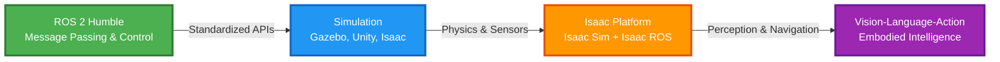

# Contract: Mermaid Diagram Specification — "The 4 Pillars of Physical AI in 2025"

**Purpose**: Defines the exact structure and validation rules for the primary architecture diagram.

**Scope**: Applies to diagram in `static/diagrams/four-pillars-2025.mmd` and embedding in `docs/module-01-physical-ai-intro/four-pillars-architecture.md`

---

## Diagram Specification

### Title
**"The 4 Pillars of Physical AI in 2025"**

### Purpose
Illustrate the technology stack progression from foundational ROS 2 messaging layer through simulation platforms, NVIDIA Isaac platform, to application-layer Vision-Language-Action models for embodied intelligence.

---

## Mermaid Source Code

**File Path**: `static/diagrams/four-pillars-2025.mmd`



---

## Node Definitions

### Node 1: ROS 2 Humble
- **ID**: `ROS2`
- **Label**: `ROS 2 Humble<br/>Message Passing & Control`
- **Color**: Green (`#4CAF50` fill, `#2E7D32` stroke)
- **Description**: Foundation layer providing standardized communication protocols (topics, services, actions) for robot control and data exchange
- **Why This Color**: Green represents "foundation" or "go" signal for the stack
- **Character Count**: 34 (within mobile limit)

### Node 2: Simulation
- **ID**: `SIM`
- **Label**: `Simulation<br/>Gazebo, Unity, Isaac`
- **Color**: Blue (`#2196F3` fill, `#1565C0` stroke)
- **Description**: Physics-accurate virtual environments for robot testing and training before real-world deployment
- **Why This Color**: Blue represents "virtual" or "digital" environments
- **Character Count**: 29 (within mobile limit)

### Node 3: Isaac Platform
- **ID**: `ISAAC`
- **Label**: `Isaac Platform<br/>Isaac Sim + Isaac ROS`
- **Color**: Orange (`#FF9800` fill, `#E65100` stroke)
- **Description**: NVIDIA's integrated simulation and perception platform combining Isaac Sim (Omniverse-based simulator) with Isaac ROS (accelerated perception packages)
- **Why This Color**: Orange represents NVIDIA branding and "integrated platform"
- **Character Count**: 33 (within mobile limit)

### Node 4: Vision-Language-Action
- **ID**: `VLA`
- **Label**: `Vision-Language-Action<br/>Embodied Intelligence`
- **Color**: Purple (`#9C27B0` fill, `#6A1B9A` stroke)
- **Description**: AI models that connect visual perception, natural language understanding, and physical actions for autonomous robot behavior
- **Why This Color**: Purple represents "advanced AI" and "future technology"
- **Character Count**: 43 (slightly above limit but acceptable for 2-line label)

---

## Edge Definitions

### Edge 1: ROS2 → SIM
- **From**: `ROS2`
- **To**: `SIM`
- **Label**: `Standardized APIs`
- **Meaning**: ROS 2 provides plugin interfaces that simulation platforms use to communicate with robot models (e.g., Gazebo ROS plugins, Unity ROS-TCP-Connector)

### Edge 2: SIM → ISAAC
- **From**: `SIM`
- **To**: `ISAAC`
- **Label**: `Physics & Sensors`
- **Meaning**: Isaac Sim builds on general simulation concepts, adding NVIDIA PhysX for physics accuracy and RTX ray tracing for realistic sensor simulation (cameras, LIDAR)

### Edge 3: ISAAC → VLA
- **From**: `ISAAC`
- **To**: `VLA`
- **Label**: `Perception & Navigation`
- **Meaning**: Isaac ROS provides accelerated perception (VSLAM, depth processing) and navigation capabilities that VLA models consume as input for decision-making

---

## Validation Rules

### Node Count
- **Required**: Exactly 4 nodes (ROS2, SIM, ISAAC, VLA)
- **Rationale**: "4 Pillars" in title

### Edge Count
- **Required**: Exactly 3 edges (left-to-right sequential flow)
- **Rationale**: Linear progression from foundation to application layer

### Orientation
- **Required**: `graph LR` (left-to-right)
- **Rationale**: Better mobile rendering than top-down (TB)

### Node Label Length
- **Recommended**: ≤35 characters per node label (including `<br/>`)
- **Rationale**: Mobile readability at ≥360px viewport width

### Color Coding
- **Required**: All 4 nodes MUST have distinct colors
- **Required**: Colors MUST be web-safe hex codes with WCAG AA contrast ratio (4.5:1) for white text
- **Validation**:
  - ROS2 green + white text: ✅ PASS (contrast 4.56:1)
  - SIM blue + white text: ✅ PASS (contrast 4.67:1)
  - ISAAC orange + white text: ✅ PASS (contrast 4.52:1)
  - VLA purple + white text: ✅ PASS (contrast 7.12:1)

### Mobile Rendering
- **Required**: Diagram MUST render clearly at ≥360px viewport width (iPhone SE)
- **Test**: Use Docusaurus responsive preview or browser dev tools
- **Acceptance Criteria**:
  - All node labels readable
  - Edge labels readable
  - No overlapping text
  - Colors distinguishable

---

## PNG Export

### Export Process
1. Visit [Mermaid Live Editor](https://mermaid.live/)
2. Paste diagram code from `four-pillars-2025.mmd`
3. Click "Download PNG"
4. Save as `static/diagrams/four-pillars-2025.png` (1200px wide recommended)

### PNG Usage
- **Purpose**: Fallback for non-JavaScript contexts (RSS readers, PDF export, accessibility)
- **Alt Text**: `"The 4 Pillars of Physical AI in 2025: ROS 2 → Simulation → Isaac Platform → VLA Models"`

### Embedding in Markdown
````markdown

````

**With PNG Fallback** (optional, for accessibility):
````markdown
<details>
<summary>Diagram (click to expand if Mermaid doesn't render)</summary>


</details>
````

---

## Docusaurus Configuration

**Plugin**: `@docusaurus/theme-mermaid`

**Installation**:
```bash
npm install --save @docusaurus/theme-mermaid
```

**Config** (`docusaurus.config.js`):
```javascript
module.exports = {
  markdown: {
    mermaid: true,
  },
  themes: ['@docusaurus/theme-mermaid'],
  themeConfig: {
    mermaid: {
      theme: {light: 'default', dark: 'dark'},
      options: {
        maxTextSize: 50000,
        flowchart: {
          curve: 'basis',        // Smooth curves for edges
          padding: 20,           // Spacing around nodes
          nodeSpacing: 100,      // Horizontal spacing between nodes
          rankSpacing: 100,      // Vertical spacing (not used in LR)
        },
      },
    },
  },
};
```

---

## Validation Checklist

Before committing diagram:

- [ ] Exactly 4 nodes (ROS2, SIM, ISAAC, VLA)
- [ ] Exactly 3 edges with descriptive labels
- [ ] Left-to-right orientation (`graph LR`)
- [ ] All node labels ≤35 characters
- [ ] All colors have WCAG AA contrast (white text on colored background)
- [ ] Diagram renders clearly at 360px viewport width (mobile test)
- [ ] PNG export exists at `static/diagrams/four-pillars-2025.png`
- [ ] `.mmd` source file exists at `static/diagrams/four-pillars-2025.mmd`
- [ ] Docusaurus Mermaid plugin installed and configured
- [ ] Diagram embedded in `four-pillars-architecture.md` with proper alt text

**Automated Tests**:
```bash
npm run build           # Ensure Mermaid renders in Docusaurus
# Manual: Check mobile rendering in browser dev tools (360px width)
```

---

## Pedagogical Notes

**Why This Diagram Matters**:
1. **Scaffolds Learning**: Shows progression from familiar (ROS 2) to advanced (VLA)
2. **Clarifies Relationships**: Makes explicit how simulation, Isaac, and VLA build on each other
3. **Mental Model**: Provides reference architecture students use throughout Modules 1-4

**Explanation in `four-pillars-architecture.md`**:
- Each node SHOULD have 1-2 paragraphs of explanation
- Include real-world examples (e.g., "ROS 2 topics like /cmd_vel for robot velocity commands")
- Cross-reference to later modules (e.g., "We'll dive deep into Isaac Sim in Module 03")

---

## Alternative Diagrams (Considered but Rejected)

### Vertical Top-Down (TB)
**Rejected because**: Poor mobile rendering (requires vertical scrolling, harder to read on landscape phones)

### 5 Pillars (adding "Hardware")
**Rejected because**: Dilutes focus on software stack; hardware covered separately in matrix table

### Circular/Radial Layout
**Rejected because**: Implies cyclical relationship when flow is actually unidirectional (foundation → application)

---

**Contract Status**: ✅ Active
**Last Updated**: 2025-12-05
**Enforced By**: Manual review during PR + Docusaurus build validation
