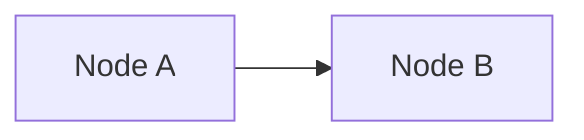

# Module 01 Quickstart Guide for Contributors

**Purpose**: Get contributors up and running with Module 01 local development in under 15 minutes.

**Last Updated**: 2025-12-05

---

## Prerequisites

Before starting:

- [ ] **Node.js 18+ LTS** installed ([Download](https://nodejs.org/))
- [ ] **Git** configured with SSH or HTTPS access
- [ ] **Text editor** (VS Code recommended with extensions)
- [ ] **Terminal** access (Bash, PowerShell, or equivalent)

**Optional** (for Isaac Sim verification):
- [ ] **Ubuntu 22.04 LTS** (native, dual-boot, or VM)
- [ ] **NVIDIA GPU** (RTX 3060+ with ≥12GB VRAM)
- [ ] **Isaac Sim 2024.1.1** installed (see `ubuntu-ros2-setup.md` in Module 01 content)

---

## Quick Setup (5 Minutes)

### 1. Clone Repository

```bash
git clone <repo-url>
cd <repo-name>
```

### 2. Checkout Feature Branch

```bash
git checkout 001-physical-ai-intro
```

### 3. Install Dependencies

```bash
npm install
```

Expected output:
```
added 842 packages in 45s
```

---

## Local Development (Live Reload)

### Start Docusaurus Dev Server

```bash
npm run start
```

Expected output:
```
[INFO] Starting the development server...
[SUCCESS] Docusaurus website is running at http://localhost:3000/
```

**What Happens**:
- Docusaurus builds the site
- Opens browser to `http://localhost:3000/`
- **Live reload enabled**: Edit markdown files → see changes instantly

### Navigate to Module 01

In browser: `http://localhost:3000/docs/module-01-physical-ai-intro/`

**Expected Pages** (sidebar):
1. Introduction (index.md)
2. Four Pillars Architecture
3. Hardware Requirements
4. Ubuntu + ROS 2 Setup
5. Isaac Sim Installation
6. Verification & Testing
7. Repository Structure
8. Next Steps & References

---

## Editing Module 01 Content

### Page Locations

All Module 01 markdown files are in:
```
docs/module-01-physical-ai-intro/
├── index.md                      # What is Physical AI?
├── four-pillars-architecture.md  # Diagram + explanation
├── hardware-requirements.md      # 2025 hardware matrix
├── ubuntu-ros2-setup.md          # OS + ROS 2 install
├── isaac-sim-installation.md     # Isaac Sim setup
├── verification-testing.md       # Carter example
├── repository-structure.md       # Repo layout + CI/CD
└── next-steps-references.md      # Curated sources
```

### Editing Workflow

1. **Open file** in editor (e.g., VS Code: `code docs/module-01-physical-ai-intro/index.md`)
2. **Edit content** (follow contracts in `specs/001-physical-ai-intro/contracts/`)
3. **Save file** (Ctrl+S / Cmd+S)
4. **Check browser** (auto-reload shows changes in ~2 seconds)
5. **Iterate** until satisfied

---

## Creating/Editing Mermaid Diagrams

### Diagram Locations

```
static/diagrams/
├── four-pillars-2025.mmd         # Mermaid source (EDITABLE)
└── four-pillars-2025.png         # PNG export (fallback)
```

### Editing Process

**Option 1: Mermaid Live Editor** (Recommended for beginners)

1. Open [Mermaid Live Editor](https://mermaid.live/)
2. Paste content from `static/diagrams/four-pillars-2025.mmd`
3. Edit diagram in live editor
4. Preview updates in real-time
5. Copy updated code back to `.mmd` file
6. Click "Download PNG" → save as `four-pillars-2025.png`

**Option 2: Direct File Edit** (For experienced users)

1. Edit `static/diagrams/four-pillars-2025.mmd` directly
2. Refresh Docusaurus page embedding the diagram
3. Verify rendering (if broken, check syntax)

### Embedding in Page

````markdown

````

See `contracts/mermaid-diagram.md` for full specification.

---

## Validation & Testing

### 1. Markdown Linting

**Check syntax and formatting**:
```bash
npm run lint-markdown
```

Expected output (if passing):
```
✓ All markdown files passed linting
```

**Fix common issues automatically**:
```bash
npm run lint-markdown --fix
```

### 2. Link Checking

**Validate all external + internal links**:
```bash
npm run check-links
```

Expected output (if passing):
```
✓ All links returned HTTP 200
✓ No broken links detected
```

**Failures**:
- HTTP 404: Link not found → update primary URL + archive.is backup
- HTTP 500: Server error → verify archive.is backup is accessible

### 3. Build Test

**Full Docusaurus build** (as CI/CD will run):
```bash
npm run build
```

Expected output:
```
[SUCCESS] Generated static files in `build`.
[SUCCESS] You can now deploy the `build` folder.
```

**Failures**:
- Broken internal links → fix relative paths
- Mermaid syntax errors → validate diagram code
- Missing files → ensure all referenced assets exist

---

## Common Tasks

### Add a New Page to Module 01

1. **Create file** in `docs/module-01-physical-ai-intro/`:
   ```bash
   touch docs/module-01-physical-ai-intro/new-page.md
   ```

2. **Add front matter**:
   ```yaml
   ---
   title: "New Page Title"
   sidebar_label: "Short Label"
   sidebar_position: 9
   ---
   ```

3. **Write content** (follow `contracts/page-structure.md`)

4. **Update sidebar** (auto-detected, or edit `sidebars.js` if custom order needed)

5. **Test** (check `http://localhost:3000/docs/module-01-physical-ai-intro/new-page`)

### Create Archive.is Backup for Link

1. Visit https://archive.is/
2. Paste primary URL (e.g., `https://www.nvidia.com/...`)
3. Click "Save the page"
4. Wait for archival (10-30 seconds)
5. Copy resulting URL (format: `https://archive.is/XXXXX`)
6. Update markdown:
   ```markdown
   [Link Text](https://primary-url.com) ([archive](https://archive.is/XXXXX))
   ```

### Update Hardware Matrix Prices

1. Open `docs/module-01-physical-ai-intro/hardware-requirements.md`
2. Find table row (e.g., "Mid Tier")
3. Update price column: `$2,799 (2025-12)` → `$2,899 (2026-01)`
4. Verify vendor links still work (run `npm run check-links`)
5. Update archive.is links if vendor URLs changed

---

## Git Workflow

### Before Committing

1. **Run validations**:
   ```bash
   npm run lint-markdown
   npm run check-links
   npm run build
   ```
   All must pass ✅

2. **Review changes**:
   ```bash
   git status
   git diff
   ```

3. **Stage files**:
   ```bash
   git add docs/module-01-physical-ai-intro/
   git add static/diagrams/
   ```

4. **Commit** (follow project conventions):
   ```bash
   git commit -m "docs(module-01): Update hardware matrix with 2025-12 pricing"
   ```

### Pushing Changes

```bash
git push origin 001-physical-ai-intro
```

**Triggers**:
- **Lint workflow** (`.github/workflows/lint.yml`) runs automatically
- Checks markdown syntax, link validity
- PR cannot merge if lint fails

---

## CI/CD Workflows

### 3 Automated Workflows

**1. Lint Workflow** (`lint.yml`)
- **Triggers**: Push, Pull Request
- **Steps**: Markdown lint + link check
- **Duration**: ~2-3 minutes
- **Blocks**: PR merge if failing

**2. Build Workflow** (`build.yml`)
- **Triggers**: Pull Request to `main`
- **Steps**: `npm ci` + `npm run build`
- **Duration**: ~3-5 minutes
- **Blocks**: PR merge if build fails

**3. Deploy Workflow** (`deploy.yml`)
- **Triggers**: Push to `main` branch
- **Steps**: Build + deploy to GitHub Pages
- **Duration**: ~5-7 minutes
- **Result**: Site live at `https://<username>.github.io/<repo-name>/`

### Viewing Workflow Results

1. Go to GitHub repository → "Actions" tab
2. Click on latest workflow run
3. Expand steps to see detailed logs
4. Fix any reported errors before re-pushing

---

## VS Code Extensions (Recommended)

Install for better productivity:

1. **Markdown All in One** (`yzhang.markdown-all-in-one`)
   - Table of contents, formatting, preview

2. **markdownlint** (`DavidAnson.vscode-markdownlint`)
   - Real-time linting as you type

3. **Code Spell Checker** (`streetsidesoftware.code-spell-checker`)
   - Catches typos in markdown content

4. **Mermaid Preview** (`bierner.markdown-mermaid`)
   - Preview Mermaid diagrams in VS Code

Install all at once:
```bash
code --install-extension yzhang.markdown-all-in-one
code --install-extension DavidAnson.vscode-markdownlint
code --install-extension streetsidesoftware.code-spell-checker
code --install-extension bierner.markdown-mermaid
```

---

## Troubleshooting

### "npm install" Fails

**Error**: `EACCES` permission denied

**Solution** (Linux/macOS):
```bash
sudo chown -R $(whoami) ~/.npm
npm install
```

**Solution** (Windows):
Run PowerShell as Administrator, then:
```powershell
npm install
```

### "npm run start" Port Already in Use

**Error**: `Port 3000 is already in use`

**Solution**:
```bash
# Option 1: Kill process on port 3000
npx kill-port 3000
npm run start

# Option 2: Use different port
npm run start -- --port 3001
```

### Mermaid Diagram Not Rendering

**Symptoms**: See code block instead of diagram

**Check**:
1. Is `@docusaurus/theme-mermaid` installed? (`npm list @docusaurus/theme-mermaid`)
2. Is `docusaurus.config.js` configured correctly? (see `contracts/mermaid-diagram.md`)
3. Is diagram syntax valid? (test in [mermaid.live](https://mermaid.live/))

**Fix**:
```bash
npm install --save @docusaurus/theme-mermaid
npm run start
```

### Link Checker False Positives

**Error**: "HTTP 429 Too Many Requests" for valid URL

**Cause**: Rate limiting from link checker tool

**Solution**: Add to `.linkcheckrc.json`:
```json
{
  "ignorePatterns": [
    {"pattern": "https://example.com/rate-limited-url"}
  ]
}
```

---

## Quick Reference: npm Scripts

| Command                  | Purpose                                    |
|--------------------------|--------------------------------------------|
| `npm run start`          | Start dev server with live reload          |
| `npm run build`          | Build static site for production           |
| `npm run lint-markdown`  | Check markdown syntax and style            |
| `npm run check-links`    | Validate all external + internal links     |
| `npm run serve`          | Preview production build locally           |
| `npm run clear`          | Clear Docusaurus cache (if build issues)   |

---

## Getting Help

**Documentation**:
- Docusaurus: https://docusaurus.io/docs
- Mermaid: https://mermaid.js.org/intro/
- Markdown: https://commonmark.org/help/

**Project-Specific**:
- Spec: `specs/001-physical-ai-intro/spec.md`
- Plan: `specs/001-physical-ai-intro/plan.md`
- Contracts: `specs/001-physical-ai-intro/contracts/`

**Issues**:
- Open GitHub issue with label `module-01`
- Include: error message, steps to reproduce, environment (OS, Node.js version)

---

**Quickstart Status**: ✅ Complete
**Estimated Setup Time**: 10-15 minutes
**Next Steps**: Start editing `docs/module-01-physical-ai-intro/index.md`!
