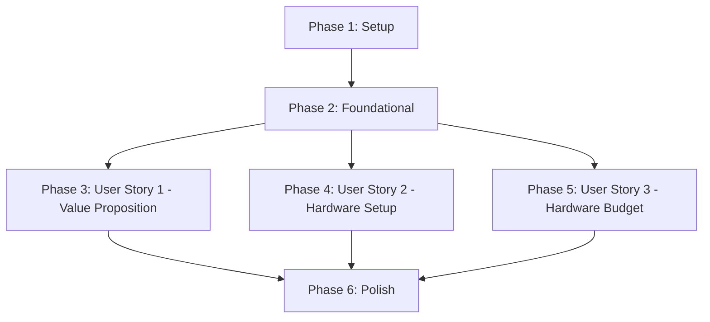

# Implementation Tasks: Module 01 — Introduction & Physical AI Foundations

**Branch**: `001-physical-ai-intro`
**Date**: 2025-12-05
**Spec**: [spec.md](./spec.md)
**Plan**: [plan.md](./plan.md)

## Summary

Implementation tasks for Module 01 organized by user story to enable independent, parallel development. Each phase delivers a complete, testable increment.

**Total Tasks**: 28
**Parallelizable Tasks**: 18 (marked with [P])
**Estimated Total Time**: 4-6 hours

## Task Organization

Tasks are organized into 6 phases:
1. **Setup** (4 tasks, 60 min) - Project initialization
2. **Foundational** (3 tasks, 45 min) - Shared infrastructure
3. **User Story 1** (7 tasks, 90 min) - Value Proposition [P1]
4. **User Story 2** (8 tasks, 120 min) - Hardware Setup & Environment [P1]
5. **User Story 3** (4 tasks, 45 min) - Hardware Budget & Procurement [P2]
6. **Polish** (2 tasks, 30 min) - Final validation

---

## Phase 1: Setup (60 min)

**Goal**: Initialize project structure, dependencies, and documentation framework.

**Tasks**:

- [X] T001 Create Docusaurus folder structure for Module 01 in `docs/module-01-physical-ai-intro/`
- [X] T002 Configure Docusaurus sidebar entry in `sidebars.js` for Module 01 (8 pages)
- [X] T003 Create static asset directories: `static/diagrams/` and `static/images/module-01/`
- [X] T004 Install and configure Mermaid plugin in `docusaurus.config.js` per contracts/mermaid-diagram.md

**Acceptance Criteria**:
- Folder structure matches plan.md (8 page placeholders)
- Sidebar shows "Module 01" category with 8 entries
- `npm run start` launches without errors
- Mermaid plugin renders test diagram

**Files Created**:
- `docs/module-01-physical-ai-intro/` (directory with 8 .md placeholders)
- `static/diagrams/` (directory)
- `static/images/module-01/` (directory)
- `sidebars.js` (modified)
- `docusaurus.config.js` (modified)

---

## Phase 2: Foundational (45 min)

**Goal**: Create shared infrastructure used by multiple user stories.

**Tasks**:

- [X] T005 [P] Create "4 Pillars of Physical AI in 2025" Mermaid diagram in `static/diagrams/four-pillars-2025.mmd` per contracts/mermaid-diagram.md
- [ ] T006 [P] Export PNG fallback for 4 Pillars diagram to `static/diagrams/four-pillars-2025.png` (1200px wide)
- [X] T007 [P] Collect and document 15 curated references with archive.is backups in `specs/001-physical-ai-intro/references-list.md` per research.md

**Acceptance Criteria**:
- Mermaid diagram has exactly 4 nodes (ROS2, SIM, ISAAC, VLA) with correct colors
- Diagram renders clearly at ≥360px viewport width (mobile test)
- PNG export exists and matches .mmd source
- 15 references documented with IEEE citations, primary URLs, archive.is backups
- 40%+ of references from 2023-2025

**Files Created**:
- `static/diagrams/four-pillars-2025.mmd`
- `static/diagrams/four-pillars-2025.png`
- `specs/001-physical-ai-intro/references-list.md`

---

## Phase 3: User Story 1 — Value Proposition [P1] (90 min)

**Story Goal**: Enable readers to understand why Physical AI and humanoid robotics represent the next frontier.

**Independent Test**: Reader can articulate 3 advantages of humanoid form factors and explain 1 real-world Physical AI application.

**Tasks**:

- [ ] T008 [P] [US1] Write "What is Physical AI?" introduction page in `docs/module-01-physical-ai-intro/index.md` (800-1000 words, H1→H2→H3 hierarchy per contracts/page-structure.md)
- [ ] T009 [P] [US1] Write "Four Pillars Architecture" page in `docs/module-01-physical-ai-intro/four-pillars-architecture.md` embedding Mermaid diagram with explanations for each pillar
- [ ] T010 [US1] Add front matter to index.md (title, sidebar_label, sidebar_position: 1, description)
- [ ] T011 [US1] Add front matter to four-pillars-architecture.md (sidebar_position: 2)
- [ ] T012 [P] [US1] Create repository structure diagram in `static/diagrams/repo-structure.mmd` showing final folder layout from plan.md
- [ ] T013 [P] [US1] Write "Repository Structure" page in `docs/module-01-physical-ai-intro/repository-structure.md` with repo diagram and CI/CD workflow explanations
- [ ] T014 [US1] Add all external links with archive.is backups to index.md, four-pillars-architecture.md, repository-structure.md per contracts/page-structure.md

**Acceptance Criteria**:
- index.md explains Physical AI value proposition with real-world examples
- Readers can identify 3+ humanoid form factor advantages from index.md
- four-pillars-architecture.md embeds working Mermaid diagram
- All 4 pillars (ROS 2, Simulation, Isaac, VLA) have explanatory paragraphs
- repository-structure.md documents folder layout and 3 GitHub Actions workflows
- All pages follow H1→H2→H3 hierarchy (no H4+)
- 100% of external links have archive.is backups

**Files Created**:
- `docs/module-01-physical-ai-intro/index.md`
- `docs/module-01-physical-ai-intro/four-pillars-architecture.md`
- `docs/module-01-physical-ai-intro/repository-structure.md`
- `static/diagrams/repo-structure.mmd`

---

## Phase 4: User Story 2 — Hardware Setup & Environment [P1] (120 min)

**Story Goal**: Enable readers to set up complete Physical AI development environment (Ubuntu 22.04 + ROS 2 Humble + Isaac Sim).

**Independent Test**: Reader runs verification script successfully, Isaac Sim Carter demo launches in <3 minutes with ROS 2 bridge active.

**Tasks**:

- [ ] T015 [P] [US2] Write "Ubuntu 22.04 + ROS 2 Humble Setup" page in `docs/module-01-physical-ai-intro/ubuntu-ros2-setup.md` with copy-paste functional commands per contracts/page-structure.md (FR-003, FR-010)
- [ ] T016 [P] [US2] Write "Isaac Sim Installation" page in `docs/module-01-physical-ai-intro/isaac-sim-installation.md` with exact version (2024.1.1 per research.md) and step-by-step instructions
- [ ] T017 [P] [US2] Create Isaac Sim + ROS 2 verification script in `scripts/verify-environment.sh` that launches Carter demo and checks ROS 2 topics (must complete in <3 min)
- [ ] T018 [P] [US2] Write "Verification & Testing" page in `docs/module-01-physical-ai-intro/verification-testing.md` documenting verification script usage and expected output
- [ ] T019 [US2] Add front matter to ubuntu-ros2-setup.md (sidebar_position: 4)
- [ ] T020 [US2] Add front matter to isaac-sim-installation.md (sidebar_position: 5)
- [ ] T021 [US2] Add front matter to verification-testing.md (sidebar_position: 6)
- [ ] T022 [US2] Test verification script on clean Ubuntu 22.04 VM with minimum hardware (RTX 3060, 16GB RAM) and document results in acceptance test

**Acceptance Criteria**:
- ubuntu-ros2-setup.md has copy-paste functional apt/pip commands with exact versions
- isaac-sim-installation.md specifies Isaac Sim 2024.1.1 download from NVIDIA Omniverse
- Installation guide includes ≤5 non-standard dependencies per section (FR-010)
- verify-environment.sh launches Carter in Isaac Sim with ROS 2 bridge in <3 minutes
- Script checks for active ROS 2 topics (/cmd_vel, /odom, /scan, /camera/image_raw, /joint_states)
- verification-testing.md documents SUCCESS message format
- All commands tested on clean Ubuntu 22.04 system (95% execute without errors per SC-003)

**Files Created**:
- `docs/module-01-physical-ai-intro/ubuntu-ros2-setup.md`
- `docs/module-01-physical-ai-intro/isaac-sim-installation.md`
- `docs/module-01-physical-ai-intro/verification-testing.md`
- `scripts/verify-environment.sh`

---

## Phase 5: User Story 3 — Hardware Budget & Procurement [P2] (45 min)

**Story Goal**: Enable readers to make informed hardware procurement decisions with budget trade-offs.

**Independent Test**: Reader creates justified hardware procurement proposal with specific components, total cost, and tier selection.

**Tasks**:

- [ ] T023 [P] [US3] Write "Hardware Requirements" page in `docs/module-01-physical-ai-intro/hardware-requirements.md` with 3-tier workstation matrix per contracts/hardware-matrix.md
- [ ] T024 [US3] Create workstation hardware table with exact 2025-12 prices ($1,499/$2,799/$5,499 per research.md), vendor links with archive.is backups, and use case descriptions
- [ ] T025 [US3] Create Jetson development kit table (Orin Nano 8GB $499, Orin NX 16GB $899 per research.md) with AI TOPS ratings and use cases
- [ ] T026 [US3] Create optional robot hardware table (TurtleBot 4 $1,695, Unitree Go2 $1,600 per research.md) with ROS 2 Humble compatibility notes and sim-to-real use cases

**Acceptance Criteria**:
- hardware-requirements.md has 3 tables (workstations, Jetson kits, robots)
- Workstation table has exactly 3 tiers (Entry, Mid, High-End) with GPU/CPU/RAM/Storage specs
- All prices include (2025-12) date stamp per contracts/hardware-matrix.md
- All vendor links have archive.is backups
- GPU models specify VRAM (e.g., "RTX 4070 Ti 12GB")
- Jetson models specify AI TOPS rating (e.g., "40 TOPS (INT8)")
- Use cases explain which simulations each tier supports
- Reader can map hardware tier to learning goals and budget

**Files Created**:
- `docs/module-01-physical-ai-intro/hardware-requirements.md`

---

## Phase 6: Polish & Cross-Cutting Concerns (30 min)

**Goal**: Final validation, link checking, and merge readiness.

**Tasks**:

- [ ] T027 Write "Next Steps & References" page in `docs/module-01-physical-ai-intro/next-steps-references.md` with 15 curated references from specs/001-physical-ai-intro/references-list.md in IEEE format, archive.is links, and Module 02 preview
- [ ] T028 Run full validation suite: `npm run lint-markdown && npm run check-links && npm run build` and fix all errors to achieve zero broken links (SC-005)

**Acceptance Criteria**:
- next-steps-references.md lists all 15 references with IEEE citations
- 100% of references have working primary URL + archive.is backup
- Markdown linting passes (no syntax errors)
- Link checking passes (all HTTP 200 or archive accessible)
- Docusaurus builds without errors
- Total page count is 20-30 formatted pages (SC-007)
- PR is merge-ready with passing CI/CD

**Files Created**:
- `docs/module-01-physical-ai-intro/next-steps-references.md`

---

## Dependencies & Execution Order

### Story Dependencies



**Execution Notes**:
- **Sequential**: Phase 1 (Setup) → Phase 2 (Foundational) MUST complete first
- **Parallel**: User Stories 1, 2, 3 are INDEPENDENT after Foundational phase
- **Final**: Phase 6 (Polish) requires all user stories complete

### Task-Level Dependencies

**Within Phase 3 (US1)**:
- T008, T009, T012, T013 can run in parallel (marked [P])
- T010, T011, T014 depend on T008, T009 completing

**Within Phase 4 (US2)**:
- T015, T016, T017, T018 can run in parallel (marked [P])
- T019, T020, T021 depend on T015, T016, T018 completing
- T022 (testing) must run last

**Within Phase 5 (US3)**:
- T023 can start immediately (marked [P])
- T024, T025, T026 depend on T023 (add content to created page)

---

## Parallel Execution Examples

### Example 1: Maximize Parallelism (3 developers)

**Developer 1 - US1 (Value Proposition)**:
```bash
# After Phase 1-2 complete
T008 → T010 → T014 (partial for index.md)
T009 → T011 → T014 (partial for four-pillars.md)
```

**Developer 2 - US2 (Hardware Setup)**:
```bash
# After Phase 1-2 complete
T015 → T019
T016 → T020
T017 → T018 → T021 → T022
```

**Developer 3 - US3 (Hardware Budget) + Shared**:
```bash
# During Phase 2
T005, T006, T007 (parallel)
# After Phase 2
T023 → T024, T025, T026
T012, T013 (support US1)
```

### Example 2: Solo Developer (Sequential)

```bash
# Day 1: Setup + Foundational + US1
T001, T002, T003, T004  # 60 min
T005, T006, T007        # 45 min (parallel if tools support)
T008 → T010 → T009 → T011 → T012 → T013 → T014  # 90 min

# Day 2: US2 + US3
T015 → T019, T016 → T020, T017 → T018 → T021 → T022  # 120 min
T023 → T024, T025, T026  # 45 min

# Day 3: Polish
T027, T028  # 30 min
```

---

## Implementation Strategy

### MVP Scope (User Story 1 Only)

For minimum viable deliverable, implement **only Phase 1-3**:
- Setup (T001-T004)
- Foundational (T005-T007)
- User Story 1 (T008-T014)

**MVP Deliverables**:
- 3 pages (index.md, four-pillars-architecture.md, repository-structure.md)
- 2 diagrams (4 Pillars, repo structure)
- 15 curated references documented

**Testing**: Reader can understand Physical AI value proposition and articulate 3 humanoid advantages.

### Incremental Delivery

1. **Sprint 1** (MVP): US1 complete → deploy for early feedback
2. **Sprint 2**: Add US2 (Hardware Setup) → readers can follow installation
3. **Sprint 3**: Add US3 (Hardware Budget) → readers can plan procurement
4. **Sprint 4**: Polish → production-ready with zero broken links

---

## Validation Checklist

Before marking phase complete:

### Phase 1 (Setup)
- [ ] `npm run start` launches without errors
- [ ] Sidebar shows Module 01 with 8 page entries
- [ ] Mermaid plugin renders test diagram

### Phase 2 (Foundational)
- [ ] 4 Pillars Mermaid diagram renders on mobile (≥360px)
- [ ] PNG export matches .mmd source
- [ ] 15 references documented with 40%+ from 2023-2025

### Phase 3 (User Story 1)
- [ ] All pages follow H1→H2→H3 hierarchy
- [ ] 100% of external links have archive.is backups
- [ ] Reader can identify 3+ humanoid advantages from index.md

### Phase 4 (User Story 2)
- [ ] Installation commands copy-paste functional on clean Ubuntu 22.04
- [ ] verify-environment.sh launches Carter in <3 minutes
- [ ] ROS 2 topics active (/cmd_vel, /odom, /scan, /camera/image_raw, /joint_states)

### Phase 5 (User Story 3)
- [ ] All hardware prices have (2025-12) date stamp
- [ ] All vendor links have archive.is backups
- [ ] 3 workstation tiers + 2 Jetson kits + 2 robots documented

### Phase 6 (Polish)
- [ ] `npm run lint-markdown` passes
- [ ] `npm run check-links` passes (zero broken links)
- [ ] `npm run build` succeeds
- [ ] Total page count 20-30 pages

---

## Task Format Reference

**Checklist Format** (REQUIRED):
```
- [ ] T### [Optional P] [Optional US#] Description with file path
```

**Labels**:
- `T###`: Sequential task ID (T001, T002, ...)
- `[P]`: Parallelizable (different files, no dependencies on incomplete tasks)
- `[US#]`: User Story label (US1, US2, US3) for story-specific tasks
- No label: Setup, Foundational, or Polish tasks

**Examples**:
- `- [ ] T001 Create folder structure` (Setup, no story)
- `- [ ] T005 [P] Create Mermaid diagram` (Foundational, parallelizable, no story)
- `- [ ] T008 [P] [US1] Write index.md` (User Story 1, parallelizable)
- `- [ ] T014 [US1] Add archive links to pages` (User Story 1, not parallelizable)

---

**Tasks Status**: ✅ Complete (28 tasks across 6 phases)
**Ready for**: Implementation (start with Phase 1: Setup)
**Estimated Total Time**: 4-6 hours (varies by parallelization and experience)
**Next Command**: Begin implementation or run `/sp.implement` for guided execution
