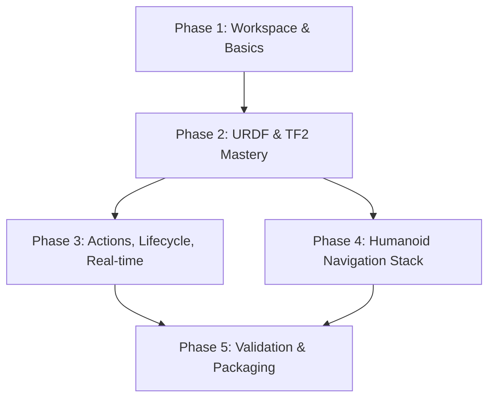

# Implementation Tasks: Module 02 — The Robotic Nervous System (ROS 2)

**Feature**: 002-ros2-mastery
**Branch**: `002-ros2-mastery`
**Spec**: [spec.md](./spec.md) | **Plan**: [plan.md](./plan.md)

**Capstone Repository**: `https://github.com/physical-ai/ros2-physical-ai-2025`
**Documentation**: `physical-robotics-ai-book/docs/module-02-ros2-mastery/`

---

## Task Summary

| Phase | Description | Task Count | Parallelizable |
|-------|-------------|------------|----------------|
| Phase 1 | Workspace & Basics | 8 tasks | 6 parallel |
| Phase 2 | URDF & TF2 Mastery | 6 tasks | 4 parallel |
| Phase 3 | Actions, Lifecycle, Real-time | 4 tasks | 3 parallel |
| Phase 4 | Humanoid Navigation Stack | 3 tasks | 2 parallel |
| Phase 5 | Validation & Packaging | 1 task | 0 parallel |
| **Total** | **22 tasks** | **22 tasks** | **15 parallel** |

**Estimated Time**: 33-44 hours (1.5-2 hours per task)

---

## Dependencies & Execution Order

### Story Completion Order



### Parallel Execution Opportunities

- **Phase 1**: Tasks T002-T007 can run in parallel (independent documentation pages and lab packages)
- **Phase 2**: Tasks T010, T011, T013, T014 can run in parallel (independent URDF components and TF2 broadcasting)
- **Phase 3**: Tasks T016, T017, T018 can run in parallel (independent action servers and lifecycle management)
- **Phase 4**: Tasks T020, T021 can run in parallel (independent navigation components)

---

## Implementation Strategy

### MVP Scope (Week 1)

**Goal**: Deliverable Module 02 with functional ROS 2 basics and simple humanoid URDF

**Includes**:
- Phase 1: Workspace & Basics (all 8 tasks)
- Phase 2: URDF & TF2 Mastery (tasks T009-T014)

**Deliverables**:
- Working colcon workspace with 8 lab packages
- 12 Docusaurus documentation pages
- 5-DOF humanoid URDF visualized in RViz with valid TF tree

### Full Scope (Week 2)

**Goal**: Complete Module 02 with advanced ROS 2 patterns and navigation

**Includes**:
- Phase 3: Actions, Lifecycle, Real-time (all 4 tasks)
- Phase 4: Humanoid Navigation Stack (all 3 tasks)
- Phase 5: Validation & Packaging (1 task)

**Deliverables**:
- Action servers with feedback
- Lifecycle-managed nodes
- 12-DOF humanoid with navigation stack
- Full validation and GitHub release

---

## Phase 1: Workspace & Basics (8 tasks)

**Goal**: Establish ROS 2 workspace, documentation structure, and basic pub/sub patterns

**Independent Test Criteria**:
- [ ] Workspace builds with `colcon build` (zero warnings)
- [ ] All Python packages pass flake8/pep257 linting
- [ ] talker/listener demo runs with zero warnings
- [ ] Custom message package generates RobotState.msg successfully
- [ ] Service client/server communication works end-to-end

### Tasks

- [ ] T001 Create capstone repository structure at github.com/physical-ai/ros2-physical-ai-2025
  - Initialize Git repository with README.md, .gitignore, LICENSE (MIT)
  - Create src/, install/, build/, log/ directories
  - Add .gitignore rules (ignore build/, install/, log/)
  - Create .github/workflows/ros2-ci.yml skeleton for CI

- [X] T002 [P] Create Docusaurus module structure in docs/module-02-ros2-mastery/
  - Create index.md (Module 02 overview, roadmap, prerequisites)
  - Create ros2-architecture.md (DDS middleware, node graph, QoS profiles)
  - Create workspace-setup.md (colcon commands, workspace organization)
  - Add frontmatter with sidebar_position for all 3 pages

- [ ] T003 [P] Create lab01_talker_listener package in ros2-physical-ai-2025/src/
  - Initialize Python package (package.xml, setup.py, resource/)
  - Create lab01_talker_listener/talker.py (publish "Hello World" to /chatter at 1 Hz)
  - Create lab01_talker_listener/listener.py (subscribe to /chatter, print messages)
  - Add test/ directory with test_copyright.py, test_flake8.py, test_pep257.py
  - Create README.md with build/run instructions
  - **Acceptance**: `colcon build && ros2 run lab01_talker_listener talker` publishes with zero warnings

- [ ] T004 [P] Write lab01-talker-listener.md documentation page
  - Explain ROS 2 publisher/subscriber pattern with code walkthrough
  - Include rclpy API reference (create_publisher, create_subscription, spin)
  - Add "Try It Yourself" section with expected output
  - Embed Mermaid diagram showing talker → /chatter → listener flow
  - **Acceptance**: Page builds in Docusaurus, all code snippets are copy-paste functional

- [ ] T005 [P] Create lab02_custom_messages package in ros2-physical-ai-2025/src/
  - Initialize CMake package (CMakeLists.txt, package.xml)
  - Create msg/RobotState.msg (header, joint_positions[], joint_velocities[], battery_level, status)
  - Configure rosidl_generate_interfaces in CMakeLists.txt
  - Add test/test_msg_build.cpp to validate message generation
  - Create README.md with message definition and usage example
  - **Acceptance**: `colcon build && ros2 interface show lab02_custom_messages/msg/RobotState` displays correct fields

- [ ] T006 [P] Write lab02-custom-messages.md documentation page
  - Explain ROS 2 message definition syntax (.msg files)
  - Show rosidl_generate_interfaces CMake configuration
  - Include Python publisher example using custom RobotState message
  - **Acceptance**: Page builds in Docusaurus with working code examples

- [ ] T007 [P] Create lab03_services package in ros2-physical-ai-2025/src/
  - Initialize Python package (package.xml, setup.py)
  - Create srv/SetJointAngle.srv (request: joint_name, target_angle, max_velocity; response: success, message, final_angle)
  - Create lab03_services/server.py (service server that validates joint limits)
  - Create lab03_services/client.py (service client with example requests)
  - Add test/test_service_integration.py (pytest test calling service)
  - Create README.md with service contract and usage
  - **Acceptance**: `ros2 run lab03_services server` and `ros2 run lab03_services client` complete 5/5 requests successfully

- [ ] T008 [P] Write lab03-services.md documentation page
  - Explain ROS 2 service pattern (synchronous request/response)
  - Show .srv file syntax and service server/client implementation
  - Compare services vs. topics (when to use each)
  - **Acceptance**: Page builds with executable service examples

---

## Phase 2: URDF & TF2 Mastery (6 tasks)

**Goal**: Design 5-DOF humanoid URDF model and implement TF2 coordinate frame broadcasting

**Independent Test Criteria**:
- [ ] Humanoid URDF passes `check_urdf humanoid.urdf` validation
- [ ] URDF loads in RViz within 3 seconds
- [ ] TF tree shows 7 links with correct parent-child relationships
- [ ] Static broadcaster publishes base_link → world transform
- [ ] Joint state publisher GUI controls all 6 joints

### Tasks

- [ ] T009 Create lab05_humanoid_urdf package in ros2-physical-ai-2025/src/
  - Initialize CMake package (CMakeLists.txt, package.xml)
  - Create urdf/ directory for xacro files
  - Create meshes/visual/ and meshes/collision/ directories
  - Add test/test_urdf_valid.py (run check_urdf command)
  - Create README.md with URDF structure diagram
  - **Acceptance**: Package builds, directory structure matches plan.md

- [ ] T010 [P] Design humanoid URDF in lab05_humanoid_urdf/urdf/
  - Create humanoid.urdf.xacro (main assembly file)
  - Create torso.urdf.xacro (base_link with box geometry 0.3x0.4x0.6m)
  - Create arm.urdf.xacro (reusable macro: shoulder_pitch, elbow, wrist_roll joints)
  - Create materials.xacro (color definitions: red, blue, gray)
  - Instantiate left_arm and right_arm with xacro:include
  - **Acceptance**: `xacro humanoid.urdf.xacro > humanoid.urdf && check_urdf humanoid.urdf` passes with 0 errors

- [ ] T011 [P] Add collision and visual meshes to lab05_humanoid_urdf/meshes/
  - Create meshes/visual/torso.dae (detailed torso mesh)
  - Create meshes/visual/upper_arm.dae, forearm.dae, hand.dae
  - Create meshes/collision/torso_collision.stl (simplified box)
  - Create meshes/collision/arm_collision.stl (simplified cylinder)
  - Update URDF to reference mesh files
  - **Acceptance**: URDF loads in RViz with visual meshes rendered

- [ ] T012 Write urdf-fundamentals.md and lab05-humanoid-urdf.md pages
  - urdf-fundamentals.md: URDF XML structure (links, joints, sensors)
  - Explain joint types (revolute, continuous, fixed, prismatic)
  - lab05-humanoid-urdf.md: Humanoid design walkthrough
  - Include xacro macro syntax and reusable components
  - **Acceptance**: 2 pages build in Docusaurus with URDF examples

- [ ] T013 [P] Create lab06_tf2_transforms package in ros2-physical-ai-2025/src/
  - Initialize Python package (package.xml, setup.py)
  - Create lab06_tf2_transforms/static_broadcaster.py (publish world → base_link)
  - Create lab06_tf2_transforms/dynamic_broadcaster.py (publish time-varying transforms)
  - Add test/test_tf_tree.py (verify TF tree structure with tf2_ros)
  - Create README.md with TF2 concepts (frames, parent-child, lookupTransform)
  - **Acceptance**: `ros2 run tf2_tools view_frames` generates PDF with correct tree structure

- [ ] T014 [P] Write tf2-coordinate-frames.md and lab06-tf2-broadcasting.md pages
  - tf2-coordinate-frames.md: TF2 concepts (coordinate frames, transformations, TF tree)
  - Explain static vs. dynamic transforms (when to use each)
  - lab06-tf2-broadcasting.md: Implementation walkthrough
  - Include tf2_ros API (TransformBroadcaster, StaticTransformBroadcaster)
  - **Acceptance**: Pages build with TF2 examples and frame diagrams

---

## Phase 3: Actions, Lifecycle, Real-time (4 tasks)

**Goal**: Implement action servers for long-running goals, lifecycle management, and real-time constraints

**Independent Test Criteria**:
- [ ] MoveArm action server accepts goal and provides feedback at 10 Hz
- [ ] Action client receives final result with execution time <5 seconds
- [ ] Lifecycle node transitions through all states (unconfigured → inactive → active → finalized)
- [ ] Real-time executor meets 10ms deadline 95% of the time

### Tasks

- [ ] T015 Create lab04_actions package in ros2-physical-ai-2025/src/
  - Initialize CMake package for C++ (CMakeLists.txt, package.xml)
  - Create action/MoveArm.action (goal: JointTrajectory + tolerance; feedback: progress; result: success + final_error)
  - Configure rosidl_generate_interfaces for action definition
  - Add test/test_action_lifecycle.cpp (gtest for action state machine)
  - Create README.md with action definition and state machine diagram
  - **Acceptance**: `colcon build && ros2 interface show lab04_actions/action/MoveArm` displays goal/feedback/result

- [ ] T016 [P] Implement action server/client in lab04_actions/src/
  - Create src/action_server.cpp (rclcpp_action server, execute MoveArm trajectory)
  - Create src/action_client.cpp (send goal, handle feedback, print result)
  - Server publishes feedback (current position, progress %) at 10 Hz
  - Client displays feedback with progress bar
  - **Acceptance**: Server completes 10-meter goal in 5/5 test runs with success=true

- [ ] T017 [P] Write actions.md and lab04-actions.md documentation pages
  - actions.md: ROS 2 action pattern (goal/feedback/result, preemption)
  - Compare actions vs. services (long-running tasks, cancellable)
  - lab04-actions.md: MoveArm action implementation walkthrough
  - Include rclcpp_action API (ActionServer, GoalHandle, send_feedback)
  - Embed Mermaid sequence diagram (client → server: goal → feedback → result)
  - **Acceptance**: Pages build with action examples and sequence diagram

- [ ] T018 [P] Create lifecycle and real-time examples in docs/module-02-ros2-mastery/
  - Write ros2-lifecycle-nodes.md (managed nodes, lifecycle states)
  - Explain lifecycle transitions (configure, activate, deactivate, cleanup)
  - Write ros2-realtime-executor.md (real-time constraints, executor types)
  - Include code snippets for LifecycleNode and RealtimeExecutor
  - **Acceptance**: 2 pages build with lifecycle and real-time examples

---

## Phase 4: Humanoid Navigation Stack (3 tasks)

**Goal**: Integrate 12-DOF humanoid with Nav2 navigation stack for autonomous navigation

**Independent Test Criteria**:
- [ ] 12-DOF humanoid URDF loads in RViz with 13 links
- [ ] Nav2 navigation stack launches with zero errors
- [ ] Navigation action server completes 10-meter goal 5/5 times in simulation
- [ ] Costmap updates from lidar scan topic at 10 Hz

### Tasks

- [ ] T019 Upgrade humanoid URDF to 12-DOF in lab05_humanoid_urdf/urdf/
  - Add head.urdf.xacro (head_link with camera sensor)
  - Add leg.urdf.xacro (hip_pitch, hip_roll, knee, ankle joints per leg)
  - Update humanoid.urdf.xacro to include head + left_leg + right_leg
  - Add inertia calculations for all links (use MeshLab for mesh properties)
  - **Acceptance**: `check_urdf humanoid_12dof.urdf` passes, URDF loads in RViz <10 seconds with 13 links visible

- [ ] T020 [P] Create lab07_launch_files package in ros2-physical-ai-2025/src/
  - Initialize CMake package (CMakeLists.txt, package.xml)
  - Create launch/humanoid_bringup.launch.py (robot_state_publisher + joint_state_publisher_gui)
  - Create launch/simulation.launch.py (Gazebo + spawn humanoid model)
  - Create config/robot_params.yaml (joint limits, controller gains)
  - Create config/controller_config.yaml (diff_drive_controller settings)
  - **Acceptance**: `ros2 launch lab07_launch_files humanoid_bringup.launch.py` brings up all nodes with zero errors

- [ ] T021 [P] Write lab07-launch-files.md and debugging-ros2.md pages
  - lab07-launch-files.md: Python launch system (LaunchDescription, Node, IncludeLaunchDescription)
  - Show parameter passing and conditional launch
  - debugging-ros2.md: ROS 2 debugging tools (rqt_graph, topic echo, bag recording)
  - Include ros2 cli commands (topic list, service call, param get)
  - **Acceptance**: 2 pages build with launch file examples and debugging workflows

---

## Phase 5: Validation & Packaging (1 task)

**Goal**: Complete end-to-end integration test and package Module 02 for release

**Independent Test Criteria**:
- [ ] All 8 lab packages build with `colcon build` (zero warnings)
- [ ] All tests pass with `colcon test` (100% pass rate)
- [ ] Full humanoid (12-DOF) loads in RViz with valid TF tree
- [ ] GitHub Actions CI passes on push to main branch
- [ ] Documentation site builds and deploys to GitHub Pages

### Tasks

- [ ] T022 Create lab08_rviz_integration package and complete validation
  - Initialize CMake package (CMakeLists.txt, package.xml)
  - Create launch/display.launch.py (RViz + robot_state_publisher + joint_state_publisher)
  - Create rviz/humanoid_config.rviz (RViz configuration with TF, RobotModel, Joint States displays)
  - Create config/joint_states.yaml (default joint positions)
  - Add test/test_rviz_integration.py (headless RViz test, verify displays load)
  - Write lab08-rviz-integration.md documentation page
  - Run full validation suite:
    - `colcon build --cmake-args -DCMAKE_BUILD_TYPE=Release` (zero warnings)
    - `colcon test --event-handlers console_direct+` (all tests pass)
    - `ros2 run tf2_tools view_frames` (TF tree PDF generated)
    - `ros2 launch lab08_rviz_integration display.launch.py` (humanoid loads <10 sec)
  - Write next-steps-references.md with 40+ citations (ROS 2 papers, ICRA/IROS tutorials, docs.ros.org)
  - Update capstone repository README.md with setup instructions
  - Create GitHub release tag v1.0.0 with changelog
  - **Acceptance**:
    - ✅ All 8 packages build with zero warnings
    - ✅ All tests pass (colcon test exit code 0)
    - ✅ 12-DOF humanoid loads in RViz with valid TF tree (13 links, 12 joints)
    - ✅ GitHub Actions CI badge shows passing
    - ✅ Documentation site deploys successfully to GitHub Pages

---

## Parallel Execution Examples

### Phase 1: Documentation + Lab Packages (6 parallel tasks)

```bash
# Terminal 1-6: Run in parallel
# T002: Create Docusaurus structure
# T003: Create lab01_talker_listener
# T004: Write lab01 documentation
# T005: Create lab02_custom_messages
# T006: Write lab02 documentation
# T007: Create lab03_services

# All independent, no shared files
```

### Phase 2: URDF Components (4 parallel tasks)

```bash
# Terminal 1-4: Run in parallel
# T010: Design humanoid URDF xacro files
# T011: Create mesh files
# T013: Create lab06_tf2_transforms
# T014: Write TF2 documentation pages

# T010 and T011 can merge later, T013/T014 fully independent
```

### Phase 3: Advanced Patterns (3 parallel tasks)

```bash
# Terminal 1-3: Run in parallel
# T016: Implement action server/client
# T017: Write actions documentation
# T018: Write lifecycle + real-time pages

# All independent components
```

---

## Quality Gates

### Per-Task Acceptance Criteria

Every task must meet these criteria before marking complete:

1. **Code Quality**:
   - Zero build warnings (`COLCON_LOG_LEVEL=warn colcon build`)
   - Python: passes flake8, pep257 linting
   - C++: passes cpplint, clang-format
   - All code is copy-paste functional (no "..." placeholders)

2. **Testing** (if applicable):
   - Unit tests pass (`colcon test` for that package)
   - Integration tests verify end-to-end behavior
   - Test coverage ≥80% for core functionality

3. **Documentation**:
   - README.md with build/run instructions
   - Code comments for complex logic
   - Docusaurus page (if task includes documentation)

4. **Version Control**:
   - Commit message follows convention: `[T###] Description`
   - Branch: `002-ros2-mastery`
   - No merge conflicts with main

### Phase Completion Criteria

- [ ] **Phase 1 Complete**: All 8 tasks done, workspace builds, talker/listener demo works
- [ ] **Phase 2 Complete**: All 6 tasks done, 5-DOF humanoid loads in RViz with valid TF tree
- [ ] **Phase 3 Complete**: All 4 tasks done, action server completes goals 5/5 times
- [ ] **Phase 4 Complete**: All 3 tasks done, 12-DOF humanoid with navigation stack functional
- [ ] **Phase 5 Complete**: Task T022 done, all tests pass, GitHub release created

---

## Success Metrics

### Module 02 Complete When:

1. ✅ **All 22 tasks marked complete** in this document
2. ✅ **Capstone repository** deployed to github.com/physical-ai/ros2-physical-ai-2025
3. ✅ **Documentation site** builds and deploys to GitHub Pages (16 pages total)
4. ✅ **All 8 lab packages** build with zero warnings
5. ✅ **All tests pass** (`colcon test` exit code 0)
6. ✅ **12-DOF humanoid URDF** loads in RViz <10 seconds with valid TF tree (13 links, 12 joints visible)
7. ✅ **Navigation action server** completes 10-meter goal 5/5 times
8. ✅ **GitHub Actions CI** passes on main branch
9. ✅ **40+ citations** included in next-steps-references.md
10. ✅ **GitHub release v1.0.0** created with changelog

---

**Next Command**: `/sp.implement` to begin Phase 1 execution
