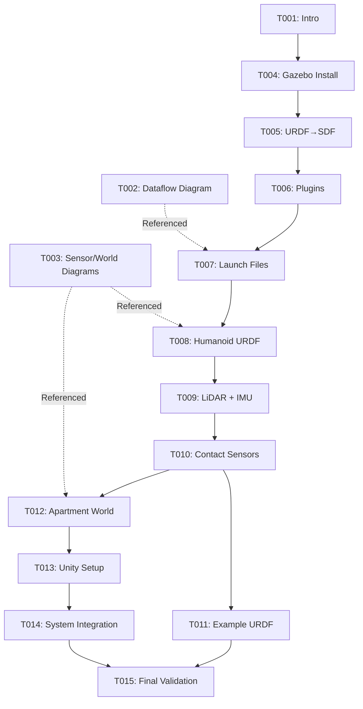

# Tasks: Module 03 — The Digital Twin (Gazebo & Unity)

**Feature**: 003-gazebo-simulation
**Branch**: 003-gazebo-simulation
**Total Tasks**: 15 (3 + 4 + 4 + 4)
**Estimated Duration**: 6.25-7.5 hours (15-30 min per task)

## Overview

This task list breaks down the implementation of Module 03 into 15 atomic, independently testable tasks organized across 4 phases. Each task is designed to be completed in 15-30 minutes and produces a working artifact.

**User Stories**:
- **[US1]** (P1): Launch Sensor-Equipped Humanoid in Gazebo
- **[US2]** (P2): Build Realistic Apartment Environment
- **[US3]** (P3): Connect Unity for Real-time Visualization

**Output Files** (exactly 4):
1. `docs/module-03/intro.md` (max 4 pages)
2. `docs/module-03/01-gazebo-fundamentals.md` (10-12 pages)
3. `docs/module-03/02-sensors-and-humanoid.md` (10-12 pages)
4. `docs/module-03/03-apartment-worlds-and-unity.md` (10-12 pages)

**Performance Targets**:
- ≥60 FPS in Gazebo
- RTF ≥1.0
- <50 MB total assets
- <10 min startup time
- Unity TCP connection <5 seconds

---

## Phase 1: Intro & Setup (3 tasks, 45-90 min)

**Goal**: Establish module structure and write introductory content

### Tasks

- [ ] T001 [P] [US1] Create module directory structure and intro.md with overview, prerequisites, learning goals, and hardware requirements in docs/module-03/intro.md
  - **Duration**: 15-20 min
  - **Dependencies**: None
  - **Acceptance**:
    - docs/module-03/ directory exists
    - intro.md contains: module overview, prerequisites (Module 01, Ubuntu 24.04, ROS 2 Jazzy), 4 learning goals, hardware requirements (RTX 4070 Ti, 16GB RAM), success criteria
    - Page count: ≤4 pages
    - Markdown valid (no broken links)
  - **Output**: `docs/module-03/intro.md`

- [ ] T002 [P] Create static/diagrams/ directory and generate Mermaid diagram for Gazebo ↔ ROS 2 ↔ Unity data flow in static/diagrams/gazebo-ros-unity-dataflow.mmd
  - **Duration**: 20-25 min
  - **Dependencies**: None
  - **Acceptance**:
    - static/diagrams/ directory exists
    - Mermaid diagram shows: Gazebo Harmonic → ros_gz_bridge → ROS 2 topics → ros_tcp_endpoint → Unity ROS TCP Connector → Unity 3D
    - Diagram includes all 10 bridged topics (joint_states, depth_camera, lidar, imu, contacts, odometry, clock)
    - Renders correctly in Markdown preview
  - **Output**: `static/diagrams/gazebo-ros-unity-dataflow.mmd`

- [ ] T003 [P] Create Mermaid diagrams for sensor integration architecture and apartment world structure in static/diagrams/
  - **Duration**: 25-30 min
  - **Dependencies**: None
  - **Acceptance**:
    - sensor-integration.mmd shows: Humanoid URDF → Gazebo Sensors System → 4 sensor types → ros_gz_bridge → ROS 2 topics
    - world-structure.mmd shows: Apartment World → 3 rooms (Living, Kitchen, Bedroom) → Furniture → Collision/Visual meshes
    - Both diagrams render correctly
  - **Output**: `static/diagrams/sensor-integration.mmd`, `static/diagrams/world-structure.mmd`

---

## Phase 2: Gazebo Fundamentals + URDF→SDF + Launch (4 tasks, 1-2 hours)

**Goal**: Write Gazebo Harmonic setup chapter with installation, URDF workflow, and launch files

### Tasks

- [ ] T004 [US1] Write Gazebo Harmonic installation and decision table sections in docs/module-03/01-gazebo-fundamentals.md
  - **Duration**: 25-30 min
  - **Dependencies**: T001 (intro structure established)
  - **Acceptance**:
    - Section 1: Installation on Ubuntu 24.04 (commands, verification)
    - Section 2: Decision table (Gazebo Harmonic vs Classic) with 5+ comparison criteria (Architecture, Support, Performance, ROS 2 integration, Python bindings)
    - Rationale for Harmonic choice clearly stated
    - All bash commands tested and executable
    - Page count: 3-4 pages
  - **Output**: `docs/module-03/01-gazebo-fundamentals.md` (partial)

- [ ] T005 [US1] Write URDF to SDF workflow section with automatic conversion examples and <gazebo> tag usage in docs/module-03/01-gazebo-fundamentals.md
  - **Duration**: 20-25 min
  - **Dependencies**: T004
  - **Acceptance**:
    - Section 3: URDF→SDF workflow explained
    - Automatic conversion via ros_gz_sim documented
    - `<gazebo>` tag examples for physics, sensors, plugins
    - Manual conversion fallback (`gz sdf -p`) documented
    - Code blocks: URDF example with <gazebo> tags, conversion commands
    - Page count: +2-3 pages (cumulative 5-7)
  - **Output**: `docs/module-03/01-gazebo-fundamentals.md` (continued)

- [ ] T006 [US1] Write Gazebo plugins and systems section covering physics, sensors, scene broadcaster in docs/module-03/01-gazebo-fundamentals.md
  - **Duration**: 25-30 min
  - **Dependencies**: T005
  - **Acceptance**:
    - Section 4: Gazebo plugins and systems
    - Physics system (DART configuration, 1kHz update)
    - Sensor system (camera, LiDAR, IMU, contact)
    - Scene broadcaster (state updates @ 60Hz)
    - ROS 2 bridge integration overview
    - SDF code blocks for each system
    - Page count: +3-4 pages (cumulative 8-11)
  - **Output**: `docs/module-03/01-gazebo-fundamentals.md` (continued)

- [ ] T007 [US1] Write launch files section with complete Python launch example and finalize 01-gazebo-fundamentals.md in docs/module-03/01-gazebo-fundamentals.md
  - **Duration**: 20-25 min
  - **Dependencies**: T006
  - **Acceptance**:
    - Section 5: Launch files (Python structure)
    - Complete launch file example: robot_state_publisher, gz_sim, ros_gz_bridge nodes
    - Launch file parameters: use_sim_time=true, world_file, bridge_config
    - Embed Gazebo↔ROS 2↔Unity dataflow diagram (reference to T002)
    - Page count: +2-3 pages (cumulative 10-12, target met)
    - All code blocks executable
  - **Output**: `docs/module-03/01-gazebo-fundamentals.md` (complete)

---

## Phase 3: Sensors + Humanoid in Simulation (4 tasks, 1-2 hours)

**Goal**: Write sensor configuration chapter with humanoid URDF, all 4 sensor types, and integration

### Tasks

- [ ] T008 [US1] Write humanoid URDF section using urdf-builder skill and depth camera configuration in docs/module-03/02-sensors-and-humanoid.md
  - **Duration**: 25-30 min
  - **Dependencies**: T007 (fundamentals complete), urdf-builder skill
  - **Acceptance**:
    - Section 1: Humanoid robot URDF (12-32 DoF, mesh optimization)
    - Using urdf-builder skill documented (automated generation)
    - Section 2: Depth camera (RealSense D435 specs)
    - SDF sensor definition (848×480 @ 30Hz, FOV 85.2°, noise σ=0.007)
    - ROS 2 topic output, RViz2 visualization
    - Embed sensor-integration diagram (reference to T003)
    - Page count: 4-5 pages
  - **Output**: `docs/module-03/02-sensors-and-humanoid.md` (partial)

- [ ] T009 [US1] Write LiDAR and IMU configuration sections with complete SDF examples in docs/module-03/02-sensors-and-humanoid.md
  - **Duration**: 20-25 min
  - **Dependencies**: T008
  - **Acceptance**:
    - Section 3: LiDAR (16-layer, 1024 samples @ 10Hz)
    - GPU-accelerated LiDAR (`gpu_lidar` type)
    - SDF configuration, noise model (σ=0.01m), point cloud visualization
    - Section 4: IMU (MEMS, 100Hz)
    - Angular velocity + linear acceleration noise with bias modeling
    - SDF configuration, IMU data interpretation
    - Page count: +3-4 pages (cumulative 7-9)
  - **Output**: `docs/module-03/02-sensors-and-humanoid.md` (continued)

- [ ] T010 [US1] Write contact sensors section and sensor integration/testing guide in docs/module-03/02-sensors-and-humanoid.md
  - **Duration**: 20-25 min
  - **Dependencies**: T009
  - **Acceptance**:
    - Section 5: Contact sensors (left/right foot @ 100Hz)
    - SDF contact sensor configuration, collision targets
    - Use in walking controllers
    - Section 6: Sensor integration and testing
    - Testing with `ros2 topic hz` commands
    - Performance validation (update rates, latency)
    - Troubleshooting guide (common issues)
    - Page count: +3-4 pages (cumulative 10-12, target met)
  - **Output**: `docs/module-03/02-sensors-and-humanoid.md` (complete)

- [ ] T011 [P] [US1] Create example humanoid URDF with all 4 sensor types using urdf-builder skill (optional asset, not in docs/)
  - **Duration**: 15-20 min
  - **Dependencies**: T010 (documentation complete), urdf-builder skill
  - **Acceptance**:
    - Humanoid URDF file generated with urdf-builder skill
    - Includes: depth_camera, lidar, imu, contact_sensors (left/right foot)
    - Visual meshes <30k triangles, collision <3k triangles
    - All sensor `<gazebo>` tags configured per specs/003-gazebo-simulation/contracts/sensor_specifications.yaml
    - File size <5 MB (part of 50 MB budget)
    - Testable: Can spawn in Gazebo, all sensors publish topics
  - **Output**: Example URDF file (location TBD, e.g., `examples/humanoid_sensor.urdf` or embedded in docs as code block)

---

## Phase 4: Apartment World + Unity Bridge + Final Validation (4 tasks, 1-2 hours)

**Goal**: Write apartment world building chapter, Unity integration, and validate complete module

### Tasks

- [ ] T012 [US2] Write apartment world design and asset sourcing sections using gazebo-world-builder skill in docs/module-03/03-apartment-worlds-and-unity.md
  - **Duration**: 25-30 min
  - **Dependencies**: T010 (sensor chapter complete), gazebo-world-builder skill
  - **Acceptance**:
    - Section 1: Apartment world design (living room, kitchen, bedroom)
    - Polygon budgets (<200k visual, <30k collision)
    - Lighting strategy (no shadows, directional lights)
    - Physics configuration (DART @ 1kHz)
    - Section 2: Asset sourcing (Free3D, Open3dModel, AWS RoboMaker)
    - Blender decimation pipeline documented
    - Visual vs collision mesh separation
    - Section 3: World building with gazebo-world-builder skill
    - Embed apartment world structure diagram (reference to T003)
    - Page count: 4-5 pages
  - **Output**: `docs/module-03/03-apartment-worlds-and-unity.md` (partial)

- [ ] T013 [US3] Write Unity visualization setup and Gazebo-Unity bridge configuration sections in docs/module-03/03-apartment-worlds-and-unity.md
  - **Duration**: 25-30 min
  - **Dependencies**: T012
  - **Acceptance**:
    - Section 4: Unity setup (2022.3 LTS, ROS TCP Connector)
    - ROSConnection configuration (127.0.0.1:10000)
    - Subscriber scripts for joint_states and depth_camera
    - Section 5: Gazebo-Unity bridge (ros_gz_bridge + ros_tcp_endpoint)
    - Bridge YAML configuration (reference to specs/003-gazebo-simulation/contracts/bridge_config.yaml)
    - Topic mapping, QoS tuning
    - Performance monitoring (latency, bandwidth)
    - Page count: +4-5 pages (cumulative 8-10)
  - **Output**: `docs/module-03/03-apartment-worlds-and-unity.md` (continued)

- [ ] T014 [US2] [US3] Write complete system integration section and generate apartment world SDF using gazebo-world-builder skill in docs/module-03/03-apartment-worlds-and-unity.md
  - **Duration**: 25-30 min
  - **Dependencies**: T013, gazebo-world-builder skill
  - **Acceptance**:
    - Section 6: Complete system integration
    - Multi-terminal launch workflow documented
    - Performance benchmarks (≥60 FPS, RTF ≥1.0)
    - Walking test procedure (10m, 5 runs, 0 falls)
    - Troubleshooting guide
    - Page count: +2-3 pages (cumulative 10-12, target met)
    - **Apartment world SDF generated** using gazebo-world-builder skill:
      - Kitchen + living room + bedroom
      - <200k visual, <20k collision polygons
      - <10 MB file size
      - Testable: Loads in Gazebo in <30 seconds, runs at ≥60 FPS
  - **Output**: `docs/module-03/03-apartment-worlds-and-unity.md` (complete), apartment world SDF file

- [ ] T015 Final validation: Run all acceptance tests and verify complete module meets success criteria
  - **Duration**: 20-30 min
  - **Dependencies**: T001-T014 (all content complete)
  - **Acceptance**:
    - **All 4 files exist**: intro.md, 01-gazebo-fundamentals.md, 02-sensors-and-humanoid.md, 03-apartment-worlds-and-unity.md
    - **Total page count**: 40-50 formatted pages (count manually or with script)
    - **FPS Test**: Launch apartment world SDF with humanoid, run `gz stats` for 60s, verify ≥60 FPS average
    - **Walking Test**: Humanoid walks 10m straight, 5 runs, 0 falls (manual test or simulation)
    - **Sensor Test**: All 4 sensor types publishing at expected rates (depth 30Hz, LiDAR 10Hz, IMU 100Hz, contacts 100Hz)
    - **Unity Test**: Unity connects to ros_tcp_endpoint in <5 seconds, joint_states latency <5ms
    - **Asset Budget**: Total asset size <50 MB (apartment SDF + meshes + textures + diagrams)
    - **Link Check**: Run markdown-link-check on all 4 docs, zero broken links
    - **Diagram Rendering**: All 3 Mermaid diagrams render correctly in Docusaurus
  - **Output**: Validation report (pass/fail for each criterion)

---

## Execution Strategy

### Sequential Dependencies

### Parallelizable Tasks

**[P] Tasks** that can be done in parallel (no blocking dependencies):

- **Phase 1**: T001, T002, T003 (all parallel - different files)
- **Phase 4**: T011 can run parallel with T012-T014 (optional asset creation vs documentation)

### MVP Scope (Minimum Viable Product)

**Recommended MVP**: Complete User Story 1 (Launch Sensor-Equipped Humanoid)

**Tasks**: T001-T011 (11 tasks, ~4.5-5.5 hours)

**Deliverables**:
- intro.md (complete)
- 01-gazebo-fundamentals.md (complete)
- 02-sensors-and-humanoid.md (complete)
- All 3 Mermaid diagrams
- Optional: Example humanoid URDF

**Validates**: Students can launch sensor-equipped humanoid in Gazebo within 10 minutes

### User Story Completion Order

1. **[US1]** Launch Sensor-Equipped Humanoid in Gazebo (P1) → Tasks T001-T011
2. **[US2]** Build Realistic Apartment Environment (P2) → Tasks T012, T014 (partial)
3. **[US3]** Connect Unity for Real-time Visualization (P3) → Tasks T013, T014 (partial)

### Independent Test Criteria per User Story

**[US1]** Launch Sensor-Equipped Humanoid:
- Test: Follow docs/module-03/intro.md + 01-gazebo-fundamentals.md + 02-sensors-and-humanoid.md
- Expected: Humanoid spawns in Gazebo within 10 min, all 4 sensors publish topics at expected rates
- Validation: `ros2 topic hz /robot/depth_camera/image_raw` (30Hz), `ros2 topic hz /robot/lidar/points` (10Hz), etc.

**[US2]** Build Realistic Apartment Environment:
- Test: Follow docs/module-03/03-apartment-worlds-and-unity.md Sections 1-3
- Expected: Apartment world SDF loads in Gazebo, includes kitchen + living room + bedroom, runs at ≥60 FPS
- Validation: `gz stats` shows ≥60 FPS, visual inspection confirms 3 rooms with furniture

**[US3]** Connect Unity for Real-time Visualization:
- Test: Follow docs/module-03/03-apartment-worlds-and-unity.md Sections 4-6
- Expected: Unity connects to ros_tcp_endpoint in <5 seconds, joint_states displayed in Unity
- Validation: Unity console shows "Connected to ROS", joint_states latency <5ms (measure with custom script)

---

## Performance Budget Validation

| Component | Target | Validation Method | Task |
|-----------|--------|-------------------|------|
| Intro.md | ≤4 pages | Manual count or script | T001 |
| 01-gazebo-fundamentals.md | 10-12 pages | Manual count | T004-T007 |
| 02-sensors-and-humanoid.md | 10-12 pages | Manual count | T008-T010 |
| 03-apartment-worlds-and-unity.md | 10-12 pages | Manual count | T012-T014 |
| **Total Pages** | **40-50 pages** | **Sum all 4 files** | **T015** |
| Apartment SDF | <10 MB | File size check | T014 |
| Humanoid URDF | <5 MB | File size check | T011 |
| Diagrams | <1 MB | File size check | T002-T003 |
| **Total Assets** | **<50 MB** | **Sum all assets** | **T015** |
| Gazebo FPS | ≥60 FPS | `gz stats` over 60s | T015 |
| RTF | ≥1.0 | `gz stats` | T015 |
| Unity Connection | <5 seconds | Timer | T015 |

---

## Risks & Mitigation

1. **Page Count Overflow**: Strict tracking after each task (T004, T005, T006, T007, T008, T009, T010, T012, T013, T014)
   - Mitigation: Use concise technical writing, avoid verbosity, move details to code comments

2. **Asset Size Exceeds 50 MB**: Verify after T011 (URDF) and T014 (Apartment SDF)
   - Mitigation: Run Blender decimation on meshes, compress textures, use primitive shapes for collision

3. **Performance <60 FPS**: Test early in T014 with apartment world + humanoid
   - Mitigation: Disable shadows, reduce sensor update rates, simplify meshes

4. **Skill Execution Failures**: urdf-builder (T011) or gazebo-world-builder (T014) may fail
   - Mitigation: Provide manual fallback instructions in documentation, test skills before task execution

---

## Task Checklist Summary

**Total**: 15 tasks
**Phases**: 4 (Setup → Gazebo Fundamentals → Sensors → Apartment + Unity)
**Parallelizable**: 4 tasks ([P] markers: T001, T002, T003, T011)
**User Stories Covered**: US1 (11 tasks), US2 (2 tasks), US3 (2 tasks), Validation (1 task)
**Output Files**: 4 Markdown files + 3 Mermaid diagrams + 1 apartment SDF + 1 humanoid URDF (optional)
**Estimated Duration**: 6.25-7.5 hours (375-450 minutes)

---

**Status**: Ready for implementation. Start with Phase 1 (T001-T003) to establish structure and diagrams.

**Next Command**: Begin execution with `T001` or run all Phase 1 tasks in parallel.
