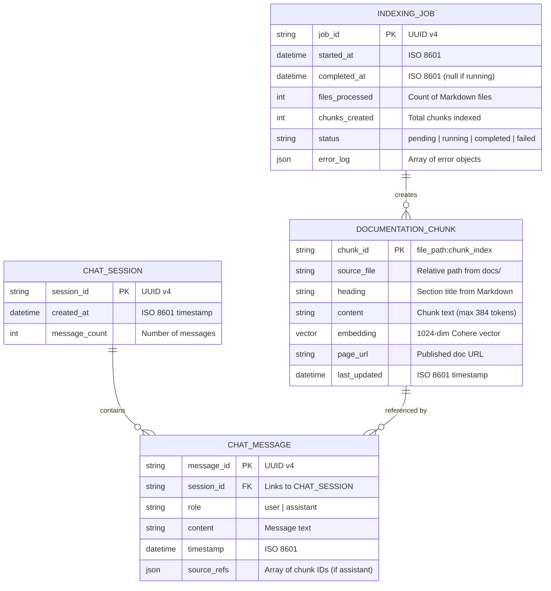
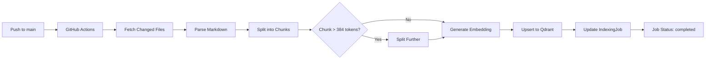

# Data Model: RAG Chatbot

**Feature**: RAG Chatbot for Physical AI & Humanoid Robotics Book
**Date**: 2025-12-07
**Source**: Derived from `spec.md` Key Entities section

---

## Entity Relationship Diagram (Mermaid)



---

## 1. Chat Session

### Description
Represents a temporary conversation context stored in-memory on the backend. No database persistence (requirement FR-018). Sessions expire after 30 minutes of inactivity or server restart.

### Fields

| Field | Type | Constraints | Description |
|-------|------|-------------|-------------|
| `session_id` | `string` | **Primary Key**, UUID v4, Required | Unique identifier for the session |
| `created_at` | `datetime` | ISO 8601, Required | Timestamp when session was created |
| `message_count` | `int` | >= 0, Default: 0 | Number of messages in the session |

### Validation Rules
- `session_id` must be a valid UUID v4 format
- `created_at` must be in UTC timezone
- Sessions automatically expire after 30 minutes of last activity (no new messages)

### State Transitions
```
[New Session] --create()--> [Active]
[Active] --expire(30min)--> [Expired/Deleted]
[Active] --server_restart--> [Deleted]
```

### Storage
- **In-Memory Dictionary**: `sessions: Dict[str, ChatSession]`
- **Cleanup**: Background task runs every 5 minutes to remove expired sessions

### Example
```json
{
  "session_id": "550e8400-e29b-41d4-a716-446655440000",
  "created_at": "2025-12-07T10:30:00Z",
  "message_count": 12
}
```

---

## 2. Chat Message

### Description
Represents a single message in a conversation, either from the user or the assistant (chatbot). Assistant messages include source references to documentation chunks used to generate the answer.

### Fields

| Field | Type | Constraints | Description |
|-------|------|-------------|-------------|
| `message_id` | `string` | **Primary Key**, UUID v4, Required | Unique identifier for the message |
| `session_id` | `string` | **Foreign Key**, UUID v4, Required | Links to parent ChatSession |
| `role` | `string` | Enum: `user` or `assistant`, Required | Sender role |
| `content` | `string` | Max length: 10,000 chars, Required | Message text content |
| `timestamp` | `datetime` | ISO 8601, Required | When message was created |
| `source_refs` | `json` | Array of strings (chunk IDs), Optional | Documentation chunks referenced (assistant only) |

### Validation Rules
- `role` must be exactly `"user"` or `"assistant"`
- `content` must not be empty string
- `content` length <= 10,000 characters (prevents abuse)
- `source_refs` required if `role == "assistant"`, must be null if `role == "user"`
- `source_refs` array length <= 10 (max source citations per answer)

### Relationships
- **Belongs to**: One `ChatSession` (many-to-one)
- **References**: Zero or more `DocumentationChunk` (many-to-many, via `source_refs`)

### Example (User Message)
```json
{
  "message_id": "7c9e6679-7425-40de-944b-e07fc1f90ae7",
  "session_id": "550e8400-e29b-41d4-a716-446655440000",
  "role": "user",
  "content": "How does Isaac Sim integrate with ROS 2?",
  "timestamp": "2025-12-07T10:31:15Z",
  "source_refs": null
}
```

### Example (Assistant Message)
```json
{
  "message_id": "9f4b2c1a-5e3d-4f8b-9c1a-2d3e4f5a6b7c",
  "session_id": "550e8400-e29b-41d4-a716-446655440000",
  "role": "assistant",
  "content": "Isaac Sim integrates with ROS 2 through the Isaac ROS package...",
  "timestamp": "2025-12-07T10:31:18Z",
  "source_refs": [
    "docs/004-isaac-platform/ros2-integration.md:3",
    "docs/004-isaac-platform/overview.md:1"
  ]
}
```

---

## 3. Documentation Chunk

### Description
Represents a semantically meaningful segment of a Markdown file (maximum 384 tokens). Includes the chunk text, vector embedding (Cohere), source metadata, and published URL.

### Fields

| Field | Type | Constraints | Description |
|-------|------|-------------|-------------|
| `chunk_id` | `string` | **Primary Key**, Format: `{file_path}:{chunk_index}`, Required | Unique identifier |
| `source_file` | `string` | Relative path from `docs/`, Required | Original Markdown file path |
| `heading` | `string` | Max 200 chars, Optional | Section title from Markdown |
| `content` | `string` | Max 384 tokens (~1536 chars), Required | Chunk text |
| `embedding` | `vector` | 1024 dimensions (float32), Required | Cohere embed-english-v3.0 vector |
| `page_url` | `string` | Valid URL, Required | Published documentation URL |
| `last_updated` | `datetime` | ISO 8601, Required | Timestamp of last index |

### Validation Rules
- `chunk_id` format: `{source_file}:{zero_based_index}` (e.g., `docs/intro.md:0`)
- `content` must tokenize to <= 384 tokens (using Cohere tokenizer)
- `embedding` must have exactly 1024 dimensions (Cohere embed-english-v3.0 output size)
- `page_url` must start with `https://your-username.github.io/your-project-name/`
- `source_file` must exist in repository at index time

### Identity & Uniqueness
- **Primary Key**: `chunk_id` (composite of file path + chunk index)
- **Uniqueness Constraint**: Each file can have multiple chunks (0-indexed), but each `chunk_id` is globally unique
- **Update Strategy**: Upsert by `chunk_id` (replaces existing chunk on reindex)

### Relationships
- **Created by**: One `IndexingJob` (many-to-one)
- **Referenced by**: Zero or more `ChatMessage` (many-to-many, via `source_refs`)

### Example
```json
{
  "chunk_id": "docs/004-isaac-platform/ros2-integration.md:3",
  "source_file": "docs/004-isaac-platform/ros2-integration.md",
  "heading": "ROS 2 Humble Integration",
  "content": "Isaac Sim supports ROS 2 Humble Hawksbill through the Isaac ROS package. This enables bi-directional communication between...",
  "embedding": [0.023, -0.145, 0.678, ...],  // 1024 floats
  "page_url": "https://your-username.github.io/your-project-name/docs/004-isaac-platform/ros2-integration#ros-2-humble-integration",
  "last_updated": "2025-12-07T09:15:30Z"
}
```

---

## 4. Indexing Job

### Description
Represents a batch re-indexing operation triggered by GitHub Actions when Markdown files are pushed to `main` branch. Tracks processing status, success/failure counts, and error logs.

### Fields

| Field | Type | Constraints | Description |
|-------|------|-------------|-------------|
| `job_id` | `string` | **Primary Key**, UUID v4, Required | Unique identifier for the job |
| `started_at` | `datetime` | ISO 8601, Required | Timestamp when job started |
| `completed_at` | `datetime` | ISO 8601, Optional (null if running) | Timestamp when job finished |
| `files_processed` | `int` | >= 0, Default: 0 | Count of Markdown files processed |
| `chunks_created` | `int` | >= 0, Default: 0 | Total chunks indexed/updated |
| `status` | `string` | Enum: `pending` \| `running` \| `completed` \| `failed`, Required | Current job status |
| `error_log` | `json` | Array of error objects, Default: `[]` | Errors encountered during processing |

### Validation Rules
- `status` must transition in order: `pending` → `running` → `completed` or `failed`
- `completed_at` must be null while `status == "running"`
- `completed_at` must be set when `status == "completed"` or `"failed"`
- `files_processed` and `chunks_created` must be >= 0

### State Transitions
```
[pending] --start()--> [running]
[running] --success()--> [completed]
[running] --error()--> [failed]
```

### Error Log Format
Each error object in `error_log` array:
```json
{
  "file": "docs/broken-file.md",
  "error": "Invalid Markdown syntax at line 42",
  "timestamp": "2025-12-07T09:16:45Z"
}
```

### Relationships
- **Creates**: Zero or more `DocumentationChunk` (one-to-many)

### Example (Completed Job)
```json
{
  "job_id": "a1b2c3d4-e5f6-4a7b-8c9d-0e1f2a3b4c5d",
  "started_at": "2025-12-07T09:15:00Z",
  "completed_at": "2025-12-07T09:18:23Z",
  "files_processed": 47,
  "chunks_created": 2,341,
  "status": "completed",
  "error_log": []
}
```

### Example (Failed Job)
```json
{
  "job_id": "b2c3d4e5-f6a7-4b8c-9d0e-1f2a3b4c5d6e",
  "started_at": "2025-12-07T10:00:00Z",
  "completed_at": "2025-12-07T10:02:15Z",
  "files_processed": 12,
  "chunks_created": 0,
  "status": "failed",
  "error_log": [
    {
      "file": "docs/new-chapter/intro.md",
      "error": "Cohere API rate limit exceeded",
      "timestamp": "2025-12-07T10:01:50Z"
    }
  ]
}
```

---

## Data Volume & Scale Assumptions

| Entity | Estimated Count | Growth Rate | Storage |
|--------|----------------|-------------|---------|
| `ChatSession` | 10-50 concurrent | 1000/day | In-memory (512 MB limit) |
| `ChatMessage` | 100-500 active | 10,000/day | In-memory (30 min TTL) |
| `DocumentationChunk` | ~10,000 | +500/month | Qdrant Cloud (< 1 GB) |
| `IndexingJob` | 1-5/day | 150/month | PostgreSQL (future, optional) |

### Storage Breakdown
- **In-Memory (Backend)**: Sessions + Messages (~200 MB active, cleared on restart)
- **Qdrant Cloud**: Chunks + Embeddings (~800 MB for 10k chunks × 1024 dims × 4 bytes/float)
- **GitHub Actions Logs**: Indexing job history (managed by GitHub, 90-day retention)

---

## Indexing Pipeline (Data Flow)



---

## Data Lifecycle

### Chat Session Lifecycle
1. **Creation**: User opens chat widget → `POST /api/sessions` → New `ChatSession` created
2. **Active**: User sends messages → `ChatMessage` objects appended to session history
3. **Expiration**: 30 minutes of inactivity → Session removed from memory
4. **Deletion**: Server restart → All sessions cleared

### Documentation Chunk Lifecycle
1. **Creation**: GitHub Actions triggers reindex → Markdown parsed → Chunks created
2. **Update**: File modified → Existing chunks replaced (upsert by `chunk_id`)
3. **Deletion**: File deleted → Chunks with matching `source_file` removed from Qdrant

### Indexing Job Lifecycle
1. **Initiation**: GitHub Actions workflow starts → `IndexingJob` created (`status: pending`)
2. **Execution**: Reindex script runs → `status: running`
3. **Completion**: All files processed → `status: completed` or `failed`
4. **Archival**: Job logs stored in GitHub Actions (90-day retention)

---

## Consistency & Integrity

### Referential Integrity
- **ChatMessage.session_id → ChatSession.session_id**: Enforced in-memory (Python dict lookup)
- **ChatMessage.source_refs → DocumentationChunk.chunk_id**: Soft reference (no foreign key, validated at query time)

### Eventual Consistency
- **Reindexing**: Changes to `docs/` appear in chat after GitHub Actions completes (~5 min)
- **Session State**: No cross-server session sharing (single-instance deployment on Render)

### Data Validation
- **Schema Enforcement**: Pydantic models validate all entities before storage
- **Embedding Dimension Check**: Assert `len(embedding) == 1024` before upserting to Qdrant
- **Token Count Validation**: Use Cohere tokenizer to enforce 384-token limit

---

## Security & Privacy

### Data Retention
- **Chat Sessions**: Retained in-memory for 30 minutes, never persisted to disk
- **Documentation Chunks**: Public data, retained indefinitely in Qdrant
- **Indexing Jobs**: Logs retained by GitHub Actions (90 days)

### PII Handling
- **No User Authentication**: No PII collected (anonymous sessions)
- **Chat Content**: User questions may contain domain-specific terms but not stored permanently

### Access Control
- **Qdrant**: API key secured in GitHub Secrets + Render environment variables
- **Cohere**: API key secured similarly
- **Gemini**: API key secured similarly

---

## Status

✅ **Data model complete** - Ready for API contract design (Phase 1 next step)
