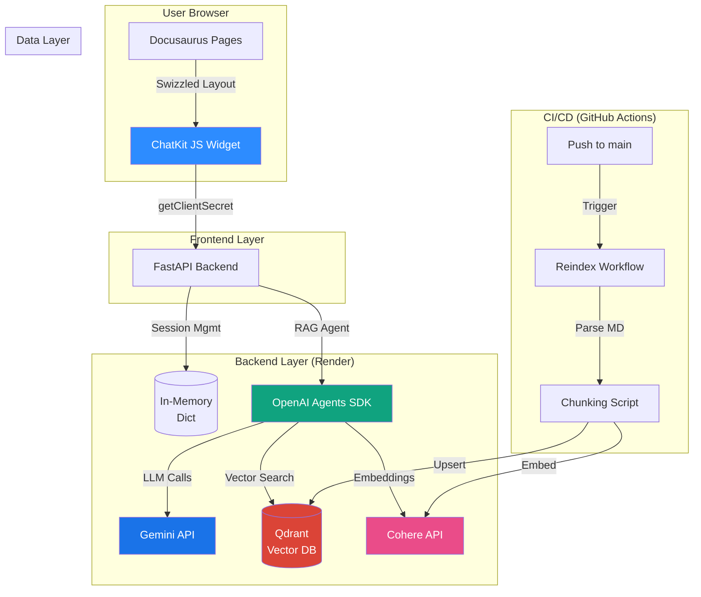
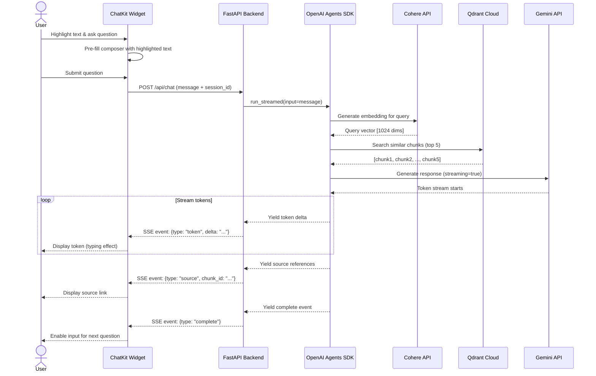
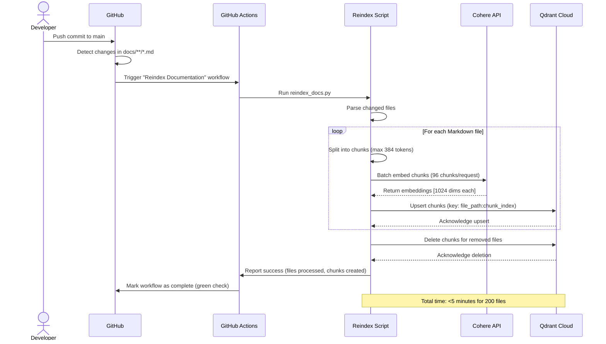
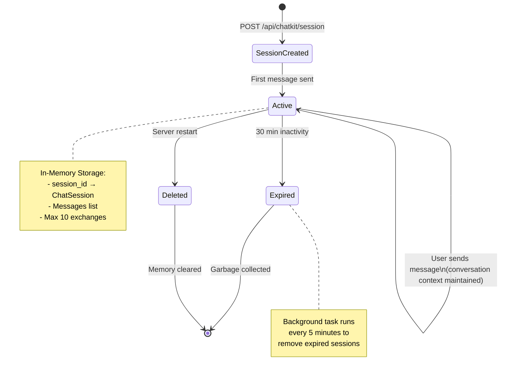
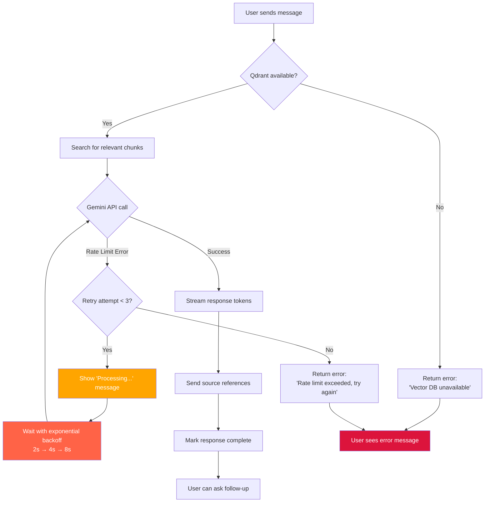
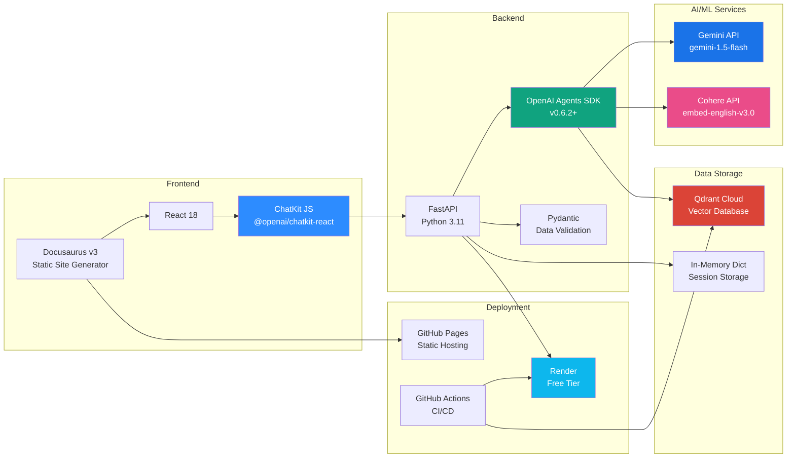

# RAG Chatbot Architecture Diagrams

**Feature**: RAG Chatbot for Physical AI & Humanoid Robotics Book
**Date**: 2025-12-07

---

## 1. System Architecture Overview



---

## 2. Chat Flow (User Query → Streaming Response)



---

## 3. Auto-Reindex Flow (GitHub Push → Vector DB Update)



---

## 4. Session Management & Context Persistence



---

## 5. Error Handling & Rate Limit Recovery



---

## 6. Deployment Architecture (Render Free Tier)

```mermaid
graph TB
    subgraph "GitHub Repository"
        A[main branch]
    end

    subgraph "Render Cloud"
        B[Web Service<br/>FastAPI Backend]
        C[Environment Variables<br/>GEMINI_API_KEY<br/>COHERE_API_KEY<br/>QDRANT_URL<br/>QDRANT_API_KEY]
        B -.->|Reads| C
    end

    subgraph "External Services"
        D[Qdrant Cloud<br/>Vector Database]
        E[Gemini API<br/>LLM]
        F[Cohere API<br/>Embeddings]
    end

    subgraph "GitHub Pages"
        G[Docusaurus Site<br/>Static HTML + ChatKit]
    end

    A -->|Auto-deploy| B
    A -->|Build & Deploy| G

    B -->|HTTPS| D
    B -->|HTTPS| E
    B -->|HTTPS| F

    G -->|fetch() calls| B

    H[User Browser] -->|HTTPS| G
    H -->|WebSocket| B

    style B fill:#0db7ed,color:#fff
    style G fill:#25c2a0,color:#fff
    style D fill:#db4437,color:#fff
    style E fill:#1a73e8,color:#fff
    style F fill:#ea4c89,color:#fff
```

---

## 7. Component Interaction Matrix

| Component | Depends On | Provides To | Communication Protocol |
|-----------|-----------|-------------|----------------------|
| **ChatKit JS Widget** | FastAPI Backend | User Browser | HTTPS (REST + SSE) |
| **FastAPI Backend** | Gemini, Cohere, Qdrant | ChatKit Widget, GitHub Actions | HTTPS (REST) |
| **OpenAI Agents SDK** | FastAPI, Gemini, Cohere | FastAPI Backend | Python async/await |
| **Qdrant Cloud** | - | FastAPI Backend | HTTPS (gRPC) |
| **Gemini API** | - | OpenAI Agents SDK | HTTPS (REST) |
| **Cohere API** | - | OpenAI Agents SDK, Reindex Script | HTTPS (REST) |
| **GitHub Actions** | Cohere, Qdrant | - | HTTPS (REST) |
| **Docusaurus** | ChatKit Widget | User Browser | Static HTML |

---

## 8. Data Flow: Text Highlighting → Contextualized Answer

```mermaid
flowchart LR
    A[User highlights text] --> B[mouseup event listener]
    B --> C{Text length > 3 chars?}
    C -->|Yes| D[Pre-fill ChatKit composer]
    C -->|No| E[Ignore selection]

    D --> F[User clicks send]
    F --> G[POST /api/chat<br/>message: 'What is NVIDIA Isaac Sim?'<br/>context.highlighted_text: 'NVIDIA Isaac Sim 2025']

    G --> H[Backend embeds query]
    H --> I[Qdrant returns relevant chunks<br/>including chunks mentioning 'Isaac Sim 2025']

    I --> J[Gemini generates answer<br/>with context from chunks]
    J --> K[Streamed answer:<br/>'Isaac Sim is a robotics simulation platform...']

    K --> L[Source links displayed:<br/>docs/004-isaac-platform/overview.md]

    style D fill:#2D8CFF,color:#fff
    style I fill:#db4437,color:#fff
    style J fill:#1a73e8,color:#fff
```



---

## 9. Folder Structure (Implementation)

```
your-project-name/
├── backend/                        # FastAPI backend (existing)
│   ├── main.py                     # Updated with chat endpoints
│   ├── app/                        # NEW: RAG agent and session management
│   │   ├── rag_agent.py            # RAG agent configuration
│   │   └── session_manager.py      # In-memory session storage
│   ├── scripts/                    # NEW: Reindexing scripts
│   │   └── reindex_docs.py         # GitHub Actions reindex script
│   ├── models/                     # Pydantic models
│   │   ├── chat.py                 # ChatRequest, ChatMessage
│   │   └── indexing.py             # IndexingJob, DocumentChunk
│   ├── requirements.txt            # Updated with agents SDK
│   └── .env                        # Existing (GEMINI_API_KEY, etc.)
│
├── src/                            # Docusaurus theme overrides
│   ├── theme/                      # NEW: Swizzled components
│   │   └── Layout/
│   │       └── index.js            # Wrapped layout with ChatKit
│   └── components/                 # NEW: Custom components
│       └── ChatKitWidget.tsx       # ChatKit React component
│
├── docs/                           # Documentation (existing)
│   ├── 001-physical-ai-intro/
│   ├── 002-ros2-mastery/
│   ├── 003-gazebo-simulation/
│   └── 004-isaac-platform/
│
├── .github/
│   └── workflows/
│       ├── deploy.yml              # Existing
│       └── reindex.yml             # NEW: Auto-reindex workflow
│
├── specs/
│   └── rag-chatbot/
│       ├── spec.md
│       ├── plan.md
│       ├── research.md
│       ├── data-model.md
│       ├── contracts/
│       │   ├── chat-api.yaml
│       │   └── reindex-api.yaml
│       └── static/diagrams/
│           └── architecture.md     # This file
│
├── package.json                    # Updated with ChatKit dependency
├── docusaurus.config.js            # Existing
└── render.yaml                     # NEW: Render deployment config
```

---

## 10. Technology Stack Diagram



---

## Status

✅ **All architecture diagrams complete** - Ready for quickstart guide (Phase 1 next step)
